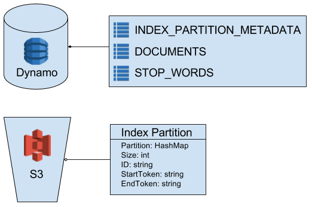
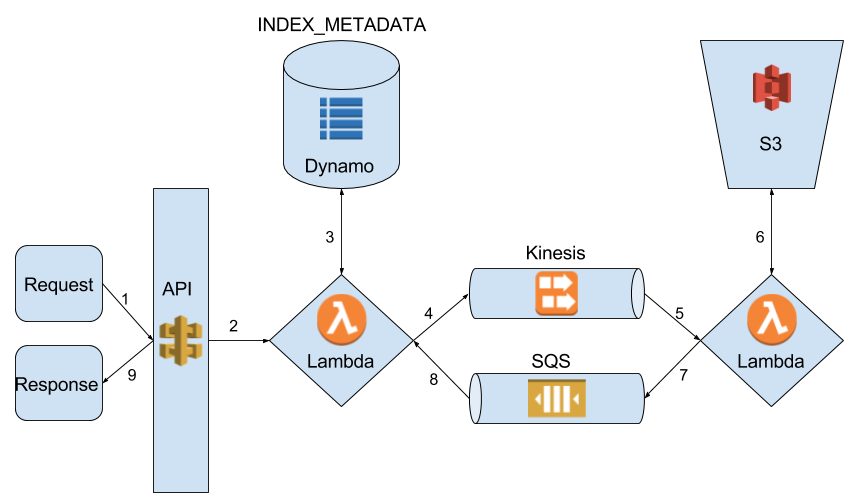
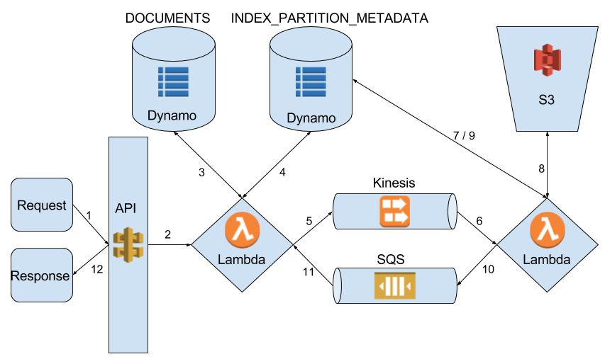

## Overview
Creating a search index for a large number of documents is not an easy task. It requires the acquisition, processing, storage, and retrieval of large amounts of
data. One of the main use cases for such an index is a web search engine. A search
engine capable of indexing the web can be divided into several large architectural
components that each perform one of the aforementioned subtasks.

| Component | Sub-task | Responsibilities |
|-----------|----------|------------------|
| Crawling  | acquisition | Crawl the web & accumulate data |
| Link Analysis | processing | Apply Page Rank to documents in the web graph |
| Text Transformation | processing | Parse tokens and metadata from documents |
| Indexing | storage, retrieval | Store & retrieve data from reverse index |
| Ranking | processing | Sort documents retrieved from index |
| Querying | retrieval | Deconstruct queries & display results |


This documentation is focused on the Indexing component, but it is important to
understand the system as a whole in order to understand the behavior the Index must
provide. The diagram below should help provide some clarity on how Indexing
interacts with the other components.

**Indexing Overview**  
  

## Constraints
When designing any large scale data storage service there are certain trade-offs
that must be made. The CAP theorem states that it's impossible for a distributed
data store to provide more than two of the following qualities: Consistency,
Availability, and Partition Tolerance. An indexing solution needs to provide all
of these qualities to some extent, but since it is impossible to fully provide
all qualities, some sacrifices need to be made. In order to search large amounts
of data, an index must be large. This requires that the index be split across
multiple partitions which makes Partition Tolerance a required quality for the
system to function properly. Since the system is distributed it means that writes
take a much longer time, and in order to provide a completely consistent state
reads and writes would need to be blocked until a write completed. If many writes
happen, this completely kills availability. As such, availability is a higher
priority than consistency. In order to be useful, the index must still provide
some consistency, but it doesn't need to always have a consistent internal state.
The system must instead guarantee eventual consistency. This means that after
the completion of writes, all reads will return the same data. Essentially changes
will not be visible until the write finishes.

The constraints inherent to distributed data stores are not the only constraints
present for this project. The other main constraint we must work around is the
inability to retain our indices within RAM. This will drastically reduce the
performance of our index as the index must be partitioned and persisted and
loaded into memory partition by partition. This incurs the overhead of loading
a serialized object into memory as well as the network overhead associated with
retrieving the partitions. While these constraints reduce our performance, they
do make the design easier in that data persistence and distribution can be easily
managed. Since the index partitions must be persisted elsewhere, there is no
concern of losing data and as such no steps must be taken to provide features such
as data replication. The other benefit this provides is that the distribution of
indices across nodes can be dynamically changed at runtime. Since the partitions
are retrieved from persistent storage on each request, we can efficiently
distribute partitions across nodes without needing to coordinate transfer of
partitions between nodes.


## Index Representation
This section will focus primarily on the structure of the index itself. This is
the place to look if you want to know what information the index stores. This
section also describes how the index is partitioned and persisted. The index is
broken up into two major parts, the reverse index partitions containing the tokens,
and a database store containing document and index metadata.

**Index Structure**  
  

### Index Representation
This is the part of the index that actually stores the tokens. Aside from storing
tokens, this structure also needs to store metadata that can only be determined
by the functional dependency of token + docID -> metadata. Metadata that fits in
this category includes location of a token in a document, the number of times a
word occurs in a document, and a version number so we know which version of data
is present.

The actual data structure that is used to store this information is a HashMap. This
gives us constant access time for any given token, so searches are extremely quick
once the structure is loaded into memory.

Each index partition will be a HashMap mapping a token to a data object
```java
import java.util.HashMap;
HashMap<String, Object> index_partition = new HashMap();
```

This is the proposed schema of the data object stored for each token:
```javascript
{
  ngramSize: int,
  documentOccurences: [
    {
      documentID: string,
      versions: [
        {
          lockNo: int,
          locations: [int]
        }
      ]
    }
  ]
}
```
This saved data object enables us to save not just the locations of a token
in multiple documents, but it also enables us to save multiple versions of
the locations within a given document. The necessity of this addition is
explained in the consistency section. It is important to note that there will
never be more than two versions of data saved for each token + document combo.

### Index Partitioning & Persistence
Since it is not possible to keep a large index in memory, the index must be
partitioned, persisted, and distributed in some manner. Since one of our constraints
is the lack of hosts, we will need to use a centralized data store rather than
keeping the partitions distributed across hosts in RAM.

One of the easiest, cheapest, and most scalable ways to accomplish this is to
serialize the partitions and to store them in S3. New index partitions can easily
be added, and partitions can be stored and retrieved in batches. This also enables a
node to iterate over the objects in a given S3 bucket, so a node could be instructed
to process a particular range of index partitions by being provided with a starting
and ending partition key.

The size of each index is also important. Partitions need to be large enough that
the overhead of de-serializing each partition into memory doesn't take too much time,
but they also must remain small enough that they can be easily transferred across
a network. They must also remain small enough that a host is able to load multiple
indices into memory. This allows the host to process multiple partitions sequentially
by loading the next partition into memory as it's searching the current partition.
Indices will also need to be merged as tokens are added/removed from the index. This
will be performed by a background process. More information on how this will work
can be found below.

The final important aspect to consider when partitioning an index is how tokens
are distributed across index partitions. Given a write heavy load, it would make
sense to distribute tokens randomly across all partitions as this would prevent
hot spots and would enable performant writes. The downside to this arrangement is
twofold: First, duplicate tokens might be stored since a token may already be
present in a different partition. Second, this makes read inefficient as every
index partition must be searched to guarantee that all data was retrieved. A
different solution that would be more optimal for a read heavy load is to partition
the index based upon the ranges of tokens in each segment. Each partition will
contain tokens beginning with the same character, and each partition will know
which alphabetical range of tokens it contains. This enables us to easily narrow
down which index partitions might contain a particular token thus providing
much more performant reads.

### Index Metadata Table
Given that the index is partitioned and persisted externally, we need some way
to determine which tokens are in which partitions as well as where each partition
is stored. This needs to be done without having to load partitions into memory,
thus this metadata must be stored externally. As mentioned in the previous section,
the index is partitioned based on the starting character of tokens, and each
partition stores tokens within a certain range. The starting character for each
partition will not change after creation of the partition, but the range of tokens
stored in each index can change with updates. This necessitates that the database
documents containing indices ranges must be stratified by partition in order to
avoid a database partition hotspot. We don't want to update the same document every
time we write to a partition.

```javascript
INDEX_PARTITION_METADATA
{
  pKey: string,
  sortKey: string,
  uri: string,
  size: int,
  versionNo: int
}
```

The sortKey will have the format "startingToken|endingToken"
The format of the sort key makes it possible to perform range queries that
retrieve all documents for partitions relevant to a given token. Concatenating
the tokens in this format essentially provides sorting first based on first by the
token at the start of the range stored in that partition, and secondarily based on
the token at the end of the alphabetical range stored in the partition.

### Document Table
In addition to storing information about which tokens are found in which documents,
the search index must also store and retrieve metadata regarding each document.
Document metadata will be persisted in the DOCUMENTS table in DynamoDB. The types
of metadata stored can be broken up into two categories: internal and external.

**Internal**  
Internal metadata is metadata saved for each document that is needed to provide
synchronization and consistency across nodes.

**External**  
External metadata is metadata that is stored for each document that is not used
by the index itself, but is instead needed for Ranking to use in their algorithm.

The proposed document metadata schema is this:
```javascript
DOCUMENTS
{
  pKey: string,
  internal: {
    lockNo: int,
    updating: bool,
    markedForDeletion: bool,
    lastUpdate: datetime,
    tokenCount: int
  },
  external: {
    wordCount: int,
    pageLastIndexed: datetime,
    importantTokenRanges: [
      {
        fieldName: string,
        rangeStart: int,
        rangeEnd: int
      }
    ]
  }
}
```

## Index Behavior
This section will focus on index behavior. This section describes how various
operations can be performed on the index as well as the consistency behavior
it will exhibit due to these operations. The three main operations that will be
performed on the index will be reads, writes, and deletes. Background processes
will also need to be run on the index to perform operations that would otherwise
block availability.

### Read
Read is the core function of the index, and as such this needs to be a quick
operation. Fortunately, partitioning our index enables asynchronous parallel
searches to be run for sets of tokens. In order to launch async searches of
different partitions we will make use of AWS Lambda. Searches will begin with
a REST call to an API Gateway that trigger a Lambda. This first lambda is
responsible for deconstructing the invocation and determining which index partitions
should be searched. The input for this call should simply be JSON containing
the tokens to be queried.

```javascript
{
  tokens: [string]
}
```

Once this has been determined, the Lambda posts records to a kinesis stream which
will trigger asynchronous Lambdas to process their given partitions. The documents
posted to kinesis, and thus the inputs for the second Lambdas will be of this format:

```javascript
{
  partitionURIs: [string],
  searchTokens: [string],
  queryID: string
}
```

These intermediary Lambdas will retrieve the partitions they need to search from S3,
search for their specified tokens, and relay the results to an aggregator via SQS. The
message sent to the aggregator will be of this format:

```javascript
{
  tokens: [
    {
      token: string,
      ngramSize: int,
      documentOccurences: [
        {
          documentID: string,
          lockNo: int,
          locations: [int]
        }
      ]
    }
  ],
  queryID: string
}
```
Note that the queryID is the SQS messageGroupID.

The aggregator is responsible for combining the results of the parallel
searches and resolving any consistency issues. This is done by ensuring that
if multiple tokens match to the same document, the returned values must be for
the correct lockNo. If the lockNo differs then the search is repeated for those
specific tokens. Once the results have been combined, the aggregator retrieves
document metadata for the resulting documents. Once again, the aggregator will
compare the lockNo of the document and re-launch queries for tokens that appeared
in a given document if there is a mismatch. If a document has been deleted while
a read was in progress, tokens for the deleted document will be discarded from
the results sent to the aggregator. Once all documents have been successfully
retrieved, the aggregator sends a response of the following format to the initial
requestor.

```javascript
{
  returnCode: int,
  error: string,
  documents: [
    {
      documentID: string,
      wordCount: int,
      pageLastIndexed: datetime,
      importantTokenRanges: [
        {
          fieldName: string,
          rangeStart: int,
          rangeEnd: int
        }
      ]
    }
  ],
  tokens: [
    token: string,
    ngramSize: int,
    documentOccurences: [
      {
        documentID: string,
        locations: [int]
      }
    ]
  ]
}
```

Valid return codes are:  

| return code | meaning | description |
|-------------|---------|-------------|
| 0 | success | Read completed in its entirety without error. |
| 1 | partial failure | Read failed for one or more tokens |
| 2 | throttling failure | Read failed due to database throttling. |
| 3 | internal failure | Read failed due to internal error. |
| 4 | timeout failure | Read failed due to timeout. |

It is important to note that the role of the aggregator is performed
by the initial node that dispatched the search query.

**Read Operation**  
  

1. Incoming request is sent to API gateway.
2. API gateway triggers first lambda.
3. First lambda retrieves partition URIs for given tokens from the INDEX_PARTITION_METADATA table.
4. First lambda posts a record with to kinesis stream for each partition.
5. Kinesis stream triggers second lambda for each partition.
6. Second lambda retrieves partition from S3 bucket.
7. Second lambda posts result to SQS.
8. First lambda retrieves messages by group ID from SQS and combines results.
9. API gateway captures lambda return and sends response.

### Write
Like read, writes can also be performed concurrently. Writing to the index is more
involved than reads. Writes begin with a call to index a document. This call will
pass an object such as the one detailed below to pass all information needed to
perform the write.

```javascript
{
  documentMetadata: {
    documentID: string,
    wordCount: int,
    importantTokenRanges: [
      {
        fieldName: string,
        rangeStart: int,
        rangeEnd: int
      }
    ]
  }
  tokens: [
    token: string,
    ngramSize: int,
    locations: [int]
  ]
}
```

The first step for a write to proceed is for it to acquire a lock on a the document.
To do this it retrieves the current lockNo of the document from the database and
sets the updating field to true. If the updating field was already true the write
is abandoned and the appropriate returnCode is set in the response. If the document
does not exist already, then the write continues. If the write proceeds, then the
lambda will check the INDEX_PARTITION_METADATA table to find the partitions to which the
provided tokens will be written. The next step in the write is to dispatch records of
the following format to a kinesis stream which will trigger a Lambda to write the given
tokens.

```javascript
{
  tokenOperations: [
    {
      token: string,
      locations: [int],
      partitionURIs: [string]
    }
  ],
  lockNoNext: int,
  documentID: string,
  writeID: string
}
```

Each triggered Lambda will then determine which index partition it needs to write each
token to. If more than one potential partition exists for the given token, it will
prioritize writing to the smaller partition. If only one partition exists, but it is
at maximum size, then a new partition will be created. Writes will use optimistic locking
at the index level. The lambda will write to the index, add the index to s3 with a new
s3 identifier, and then conditionally update the corresponding index metadata document.
If the update is successful, the metadata table will now point to the updated partition,
if the update fails, the lambda exits which will initiate a retry for the kinesis record.
After writing to the partition, the Lambda sends a record in the format below to the
aggregator via SQS.

```javascript
{
  returnCode: int,
  failedTokens: [string],
  writeID: string
}
```
Note that the writeID is the SQS messageGroupID.

The aggregator sends a response back to the requestor in the following format:

```javascript
{
  returnCode: int,
  failedTokens: [string],
  documentID: string
}
```

Valid return codes are:  

| return code | meaning | description |
|-------------|---------|-------------|
| 0 | success | Write completed in its entirety without error. |
| 1 | partial failure | One or more tokens failed to write. |
| 2 | lock failure | Write failed because the document is locked. |
| 3 | throttling failure | Write failed due to database throttling. |
| 4 | internal failure | Write failed due to internal error. |
| 5 | timeout failure | Write failed due to timeout. |

**Write Operation**  
  

1. Incoming request is sent to API gateway.
2. API gateway triggers first lambda.
3. First lambda acquires lock on document via DOCUMENTS table.
4. First lambda retrieves partition URIs for given tokens from the INDEX_PARTITION_METADATA table.
5. First lambda posts a record with to kinesis stream with write operations.
6. Kinesis stream triggers second lambda, one for each record posted.
7. Second lambda reads version number of index partition from the INDEX_PARTITION_METADATA table.
8. Second lambda retrieves partition from S3 bucket, writes, and pushes back to s3 with new s3 id.
9. Second lambda conditionally updates index metadata doc if version hasn't changed.
10. Second lambda posts result to SQS.
11. First lambda retrieves messages by group ID from SQS and combines results.
12. API gateway captures lambda return and sends response.

### Delete
The delete operation has differing behavior depending on the input. The input
comes in the following format:  

```javascript
{
  documentID: string,
  tokens: [string]
}
```

If the documentID is provided without any tokens the delete operation will delete
the document and all associated tokens. If both the documentID and tokens are
provided, then the provided tokens will be deleted for the given document.

**Deleting a document**  
Deleting a document is a simple operation. The document is simply marked for removal
and the document and its associated tokens will be cleaned up by a background scan.  

**Deleting specific tokens for a given document**  
This operation is performed in a similar manner to read and write. The initial
Lambda processes the delete command and posts records triggering delete operation
lambdas. The posted records are of the following format:  

```javascript
{
  documentID: string,
  tokens: [string],
  deleteID: string
}
```

The delete operation lambda acquires a lock on the given document and determines
which partitions the given tokens are present in and removes the tokens from the
partition. For each deleted token, the tokenCount for the document is decremented.
When the tokenCount reaches 0, the document is also deleted.

After completing a delete operation, the lambdas will post a record of the following
format to an aggregator:

```javascript
{
  returnCode: int,
  deleteID: string
}
```

The Aggregator will merge results and return a response of the following format
to the requestor:

```javascript
{
  returnCode: int,
  errorMessage: string
}
```

Valid return codes are:  

| return code | meaning | description |
|-------------|---------|-------------|
| 0 | success | Delete completed in its entirety without error. |
| 1 | partial failure | One or more tokens failed to delete. |
| 2 | lock failure | Delete failed because the document is locked. |
| 3 | throttling failure | Delete failed due to database throttling. |
| 4 | internal failure | Delete failed due to internal error. |
| 5 | timeout failure | Delete failed due to timeout. |

### Consistency
Since the index is partitioned and distributed, maintaining consistency can
be quite challenging. There are a couple of scenarios which can create an
inconsistent state. This section will enumerate those scenarios and describe
the ramifications this has on index usage.

**Write finishes during read**  
If a version is updated while a read is executing, it is possible that results
from differing versions of documents could be returned. The way this consistency
issue is resolved is described in more detail in the read operation. Users can
expect to see the results of a successful write in any read that completes after
the write finishes. This is true no matter which operation was invoked first.

**Delete occurs during read**  
If a document is deleted during a read, it is possible that a read will retrieve
tokens for a document that has been marked for deletion. Upon aggregation of results
the read operation will discard any results that point to a deleted document. Once
again this behavior only occurs if a delete operation terminates prior to termination
of the read operation. Again, the order of invocation has no bearing on this
behavior.

**Writing**  
Writing can cause consistency issues if multiple writes are started for the same
document at the same time. This consistency concern is avoided in this implementation
by providing a lock on the document. Pessimistic locking is used since it is easier
to implement than optimistic locking, despite multiple updates for the same document
occurring at once being an extremely unlikely scenario. Pessimistic locking is
used simply due to the ease of implementing it. There is also no risk of deadlock
since each Lambda will never need to acquire more than one lock at a time.

### Background Scans
There are some operations that require a linear scan of the index. These operations
will be run periodically and automatically in the background. These are largely
maintenance operations.

#### N-Gram Operations
N-Grams require that determine a list of stop words to provide to Text Transformation.
In order to keep our writes performant, we will determine stop words with a background
scan rather than adding the logic to maintain the list at token insertion time. This
simplifies the implementation of stop words, while keeping the option open to switch
to the other method later. The largest drawback to collecting stop words this way is
that it causes consistency issues. The stop words won't represent a consistent state
of the index since changes to the tokens may happen during stop word collection.

**Determining stop words**
This operation requires a process to iterate over all partitions of the index and
count the number of occurrences for all tokens within the index. Only tokens with
ngramSize of 1 are checked. The top N most frequently occurring tokens are added
to the stopwords table.

```javascript
STOPWORDS
{
  pKey: string
  sortKey: int
}
```

The partition key is the token and the sort key is the number of occurences.


#### Index Partition Operations
Index partitions require linear scans in order to delete tokens and documents
that have been invalidated. Indexes also need resizing and redistribution as the
size of the overall index grows.

**Cleanup**  
This operation will iterate over all tokens in the index and check if the token
belongs to a document that was marked for deletion. If so, the token is removed
from the index and the tokenCount for the given document is decremented. When the
tokenCount for a document reaches 0, it is removed from the index.

**Resizing and Redistribution**  
This will involve a linear scan of all partitions. If a partition is at the maximum
size, the partition must be split into two partitions of half the size. This
operation will also need to check the surrounding partitions so that it can redistribute
token ranges to minimize overlap. This is to ensure that any given token is only found
in one partition (at least until we have enough data for one token to fill a partition).
This keeps reads and writes performant. Optimistic locking will be used at the partition
level to ensure that changes do not affect other operations. This also ensures that consistency
is maintained in case a partition is written to during resizing.

## Testing
Testing will be performed in two stages. First unit testing, to verify that individual
components and services behave as expected. This will help us to sift out simple bugs
before they manifest into complex system-wide errors. Once we complete our services
we will perform integration testing to ensure the operations work well with each other
and that all sub-components behave as expected when operating in conjunction.

### Unit Testing
Since we are using two different languages for our Lambdas, we will need to define
unit testing standards for both of them.

**Python**
Python has a built in testing library 'unittest'. This library allows us to easily
create test classes as well as methods. It also provides an easy way to mock dependencies
which is critically important when writing unit tests for a large scale system.
Our python code should also be optimally testable, which means we should abstract
away dependencies with some sort of wrapper, and inject the wrapper as a dependency to other
components. This necessity for this will become obvious as the number of interactions
with outside services grows for a component.

In order to run the unit tests we will use PyTest with Coverage.py. These two libraries
work very well together, and can provide us with automated testing that reports unit
test coverage. PyTest can be easily integrated into testing scripts which could enable
us to create interesting metrics such as unit testing velocity. (What % of unpushed
code is covered by current unit tests)

**Java**
The philosophy for testing Java is the same as with python, but the frameworks
for doing so are different. We will use Junit to create our test classes and to
run our tests. In order to mock dependencies, we'll use the Mockito library. The
Mockito library is powerful enough to mock dependencies, but it doesn't enable you
to mock private methods or members. This enforces good coding practices such as
using the builder pattern for dependency injection. Again, this helps ensure our
sub-components are decoupled which is important in the long run. We will use EclEmma
to keep track of our unit testing coverage for Java.

### Integration Testing
Integration testing will be performed in order to ensure our Indexing operations
exhibit consistent behavior when used together. They also help us to ensure that
the behavior of each individual service is correct in terms of inputs and outputs.
This is critical for integration with other components.

In order to perform our integration testing, we will need a separate environment
not exposed to the outside world. We can accomplish this simply by duplicating our
AWS Services and changing the URIs in our component configuration. In this DEVO
environment we should be able to create an index state consistent with the index
state in the middle of another operation. For example, we could create a "mid-write"
state that has a non-expired pessimistic lock on a document, and partially updated
tokens for that document. Then we can call our read service on the index to ensure
that the consistency behavior we expect is exhibited. This provides an easy method
for testing how operations behave while other operations are in progress since it
would otherwise require perfect timing.

**Integration Testing Scenarios**  

| Scenario | Expectation |
|----------|-------------|
| Read while Write-in-progress | Read returns state prior to write |
| Write finishes during Read | Read returns state post write |
| Delete during Read | Read returns state post delete |
| Write while delete in progress | Write succeeds |
| Resize during Read/Write/Del | Read/Write/Del exhibit normal behavior |
| Read | Read works with expected input/outputs |
| Write | Write works with expected input/outputs |
| Delete | Delete works with expected input/outputs |

## Quality Metrics
We will keep track of metrics both to ensure that our system is behaving as expected,
but also to see how we can improve performance and behavior. Additionally, we will
use metrics to keep track of the software development process and to track the
quality of the code base. These metrics will help keep us honest and ensure that
we are meeting our software development and coding standards.

**Search Engine Quality Metrics**
Scalability:
- Number of Failed Operations: This number should increase linearly with the size
of the index. If this increases faster than the size of the index, then we should
investigate the distribution of failure causes to see what is inhibiting scalability.

- Average Kinesis Iterator Age: The kinesis stream is one of the major Scalability
bottlenecks present in our application. If the kinesis iterator age is increasing, it
means requests are coming in faster than they can be processed by worker nodes. If
we see an increase here we will either need to increase the number of shards in our stream,
or increase the number of streams and use a consistent hash to decide which stream
to post records to.

Performance:
- Average Read Time: This is the core functionality of our index, and reads should
be very performant. It's also important that we don't see significant growth in this
figure over time. If we do, that means partition redistribution is not happening frequently
enough.

- Average Write Time: This is another core operation for our index. This operation
should remain consistent no matter what the size of the index, so any growth should
correspond directly with the size of the input. If this isn't the case, investigation
is required.

Correctness:
- Precision: This metric keeps track of what ratio of documents retrieved
are relevant. This metric will likely have to be generated using test fixtures
in the DEVO environment.

- Recall: This metric keeps track of the ratio of correct documents are retrieved
out of all relevant documents in the index. This metric will also have to be generated
using test fixtures in the DEVO environment to ensure we know the real state of the index.

**Software Development Process Metrics**

**Code Base Metrics**
Average Function Length: This metric is used to determine if functions are performing
too much logic. This metric will be stratified for Python and Java.

Average File Length: This metric can help us determine which packages or modules
are responsible for too much behavior. This will again by stratified by programming language.

Number of Clones (Java): This metric will utilize a tool named simian to help
us determine where logic is duplicated in our code. This will help us keep our
code loosely coupled so we can easily make changes. This ease of change helps
make our codebase highly maintainable.

## Coding Standards
**Python**
**Java**
